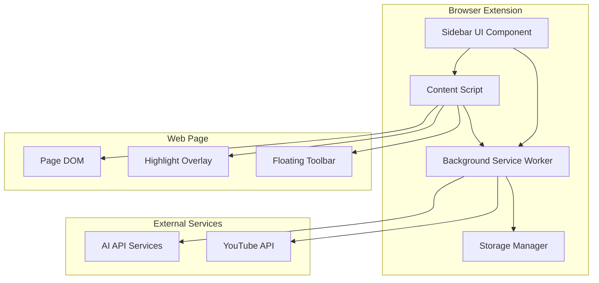

# Design Document

## Overview

The AI Browser Assistant is a cross-browser extension built using Manifest V3 architecture. It integrates AI capabilities through API calls to language models (GPT, Gemini) and provides contextual assistance through a sidebar interface, content highlighting, and floating toolbars. The extension uses a modular architecture with separate components for UI, AI processing, content analysis, and data management.

## Architecture

### High-Level Architecture



### Component Architecture

1. **Sidebar UI (React-based)**
   - Chat interface for AI interactions
   - Collection library with folder management
   - Settings and configuration panel

2. **Content Script**
   - DOM manipulation for highlighting
   - Text selection detection
   - Floating toolbar management
   - Page content analysis

3. **Background Service Worker**
   - AI API communication
   - Cross-tab state management
   - Analytics event processing
   - Storage operations coordination

4. **Storage Manager**
   - Encrypted local storage
   - Collection organization
   - User preferences
   - Analytics data buffering

## Components and Interfaces

### 1. Sidebar UI Component

**Technology Stack:**
- React 18 with TypeScript
- Tailwind CSS for styling
- Zustand for state management
- React Query for API state

**Key Interfaces:**
```typescript
interface ChatMessage {
  id: string;
  type: 'user' | 'assistant';
  content: string;
  timestamp: Date;
  metadata?: {
    highlightedElements?: string[];
    relatedVideos?: VideoRecommendation[];
  };
}

interface Collection {
  id: string;
  name: string;
  type: 'folder' | 'item';
  parentId?: string;
  content?: SavedContent;
  children?: Collection[];
}

interface SavedContent {
  id: string;
  type: 'text' | 'ai_response' | 'link';
  content: string;
  sourceUrl: string;
  timestamp: Date;
  tags?: string[];
}
```

### 2. Content Script Interface

**Responsibilities:**
- Inject highlighting overlays
- Manage floating toolbar lifecycle
- Communicate with sidebar UI
- Analyze page content for AI context

**Key Methods:**
```typescript
interface ContentScriptAPI {
  highlightElements(selectors: string[]): void;
  showFloatingToolbar(selection: Selection): void;
  hideFloatingToolbar(): void;
  extractPageContext(): PageContext;
  injectSidebar(): void;
}

interface PageContext {
  url: string;
  title: string;
  textContent: string;
  interactiveElements: ElementInfo[];
  selectedText?: string;
}
```

### 3. Background Service Worker

**Core Functions:**
- AI API request handling with retry logic
- Message routing between components
- Analytics event batching and transmission
- Storage encryption/decryption

**API Integration:**
```typescript
interface AIService {
  sendQuery(query: string, context: PageContext): Promise<AIResponse>;
  simplifyResponse(originalResponse: string): Promise<string>;
  generateMindMap(content: SavedContent[]): Promise<MindMapData>;
}

interface AIResponse {
  content: string;
  highlightSelectors?: string[];
  confidence: number;
  relatedVideos?: VideoRecommendation[];
}
```

## Data Models

### Storage Schema

**Collections Storage:**
```typescript
interface CollectionsStore {
  collections: Record<string, Collection>;
  rootFolders: string[];
  userPreferences: UserPreferences;
}

interface UserPreferences {
  aiModel: 'gpt-4' | 'gemini-pro';
  highlightDuration: number;
  autoSaveEnabled: boolean;
  analyticsEnabled: boolean;
}
```

**Chat History:**
```typescript
interface ChatSession {
  id: string;
  url: string;
  messages: ChatMessage[];
  createdAt: Date;
  lastActive: Date;
}
```

**Analytics Events:**
```typescript
interface AnalyticsEvent {
  eventName: string;
  timestamp: Date;
  properties: Record<string, any>;
  sessionId: string;
  userId?: string;
}
```

### Encryption Strategy

- Use Web Crypto API for client-side encryption
- AES-256-GCM for content encryption
- PBKDF2 for key derivation from user session
- Separate encryption keys for different data types

## Error Handling

### Error Categories and Responses

1. **AI API Failures**
   - Network timeouts: Retry with exponential backoff
   - Rate limiting: Queue requests and show user feedback
   - Invalid responses: Fallback to cached responses or error message

2. **Content Script Errors**
   - DOM access failures: Graceful degradation without highlighting
   - Permission issues: Request additional permissions or disable features
   - Page compatibility: Detect and adapt to different page structures

3. **Storage Errors**
   - Quota exceeded: Implement cleanup strategies and user notification
   - Corruption: Backup and recovery mechanisms
   - Sync conflicts: Last-write-wins with user notification

### Error Recovery Mechanisms

```typescript
interface ErrorHandler {
  handleAIError(error: AIError): Promise<void>;
  handleStorageError(error: StorageError): Promise<void>;
  handleContentScriptError(error: ContentScriptError): Promise<void>;
  reportError(error: Error, context: ErrorContext): void;
}
```

## Testing Strategy

### Unit Testing
- **Framework:** Jest + React Testing Library
- **Coverage:** All utility functions, React components, and API handlers
- **Mocking:** AI API responses, browser APIs, and DOM interactions

### Integration Testing
- **Cross-component communication:** Message passing between content script and background
- **Storage operations:** Encryption/decryption workflows
- **AI integration:** End-to-end query processing

### Browser Compatibility Testing
- **Automated:** Playwright tests across Chrome, Firefox, Edge
- **Manual:** Extension installation and core feature validation
- **Performance:** Memory usage and response time benchmarks

### User Acceptance Testing
- **Scenarios:** Real-world browsing tasks with AI assistance
- **Metrics:** Task completion time, user satisfaction scores
- **A/B Testing:** Different UI layouts and interaction patterns

## Security Considerations

### Data Protection
- All user content encrypted before storage
- No sensitive data transmitted to AI APIs without user consent
- Regular security audits of third-party dependencies

### Privacy Measures
- Optional analytics with clear opt-out mechanisms
- No cross-site tracking or user profiling
- Transparent data usage policies

### Content Security Policy
```json
{
  "content_security_policy": {
    "extension_pages": "script-src 'self'; object-src 'self'; connect-src https://api.openai.com https://generativelanguage.googleapis.com https://www.googleapis.com"
  }
}
```

## Performance Optimization

### Loading Strategy
- Lazy load sidebar UI components
- Progressive enhancement for highlighting features
- Efficient content script injection timing

### Memory Management
- Cleanup event listeners on page navigation
- Limit chat history retention (last 50 messages)
- Implement collection item pagination

### Network Optimization
- Request debouncing for AI queries
- Response caching for repeated queries
- Batch analytics events transmission

## Deployment and Distribution

### Build Process
- Webpack for bundling with code splitting
- TypeScript compilation with strict mode
- CSS optimization and minification
- Automated testing in CI/CD pipeline

### Browser Store Distribution
- Chrome Web Store with detailed privacy policy
- Firefox Add-ons with security review
- Edge Add-ons marketplace
- Automated release pipeline with version management

### Update Strategy
- Incremental updates with backward compatibility
- Feature flags for gradual rollout
- User notification system for major updates
